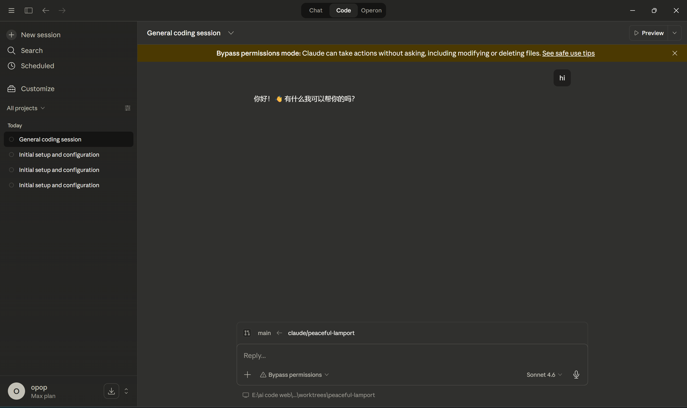

# Claude Desktop Patcher

解锁 Claude Desktop Max+Dev(Windows) 的补丁工具，Code tab自动复用本地cli配置，支持自定义API提供商。

## 解锁功能

| 功能 | 说明 |
|------|------|
| **Code Tab** | 绕过平台/VM 检查，直接启用代码编辑器侧边栏 |
| **开发者特性** | 绕过 `isPackaged` 检查，启用开发者模式 |
| **Operon** | 解锁 Operon 功能（直接返回 supported） |
| **Computer Use** | 绕过平台检查，启用计算机使用功能 |
| **默认侧边栏** | 将默认 `sidebarMode` 设为 `"code"` |
| **Claude Code 环境变量** | 自动读取 `~/.claude/settings.json` 中的 `env` 配置 |



## 使用方法

> 需要已安装 [Node.js](https://nodejs.org)（≥ 18）和 [Claude Desktop](https://claude.ai/download)

### 1. 构建补丁

**双击 `run.bat` 即可**，无需手动输入任何命令。

脚本会自动完成：安装依赖 → 查找 Claude → 应用补丁 → 生成便携版。

### 2. 启动

1. **关闭**正在运行的原版 Claude Desktop
2. 双击 `launch-claude-patched.bat` 启动补丁版

> 启动脚本会自动检测系统代理设置。如果你的系统代理已开启，Claude Desktop 会自动使用。

### 3. Claude Code 环境变量

补丁版会自动读取 `~/.claude/settings.json` 中的 `env` 字段，注入到 Claude Code 子进程。
例如你在 `settings.json` 中配置了：

```json
{
  "env": {
    "ANTHROPIC_BASE_URL": "http://localhost:8317"
  }
}
```

桌面端启动的 Claude Code 会自动使用这些环境变量，无需额外配置。

## 工作原理

1. 自动定位 Claude Desktop 的 `app.asar` 文件
2. 解包 → 应用 18 个补丁 → 重新打包
3. 关闭 Electron fuse 完整性校验
4. 生成便携版目录 + 启动脚本

## 环境要求

- **Windows**（目前仅支持 Windows）
- **Node.js** ≥ 18
- **Claude Desktop** 已安装
- **网络代理**（如果你所在地区无法直连 claude.ai，需开启系统代理）

## 夹带私货

gemini，claude，openAI全模型，包含纯血高速opus4.6（可以用所有检测工具测试）
也有性价比opus4.6(提示词污染)渠道可以免费用哦，
注册20刀，签到10刀，拉新20刀，充值比例1：10

中转链接：
https://new2.882111.xyz/

交流群


