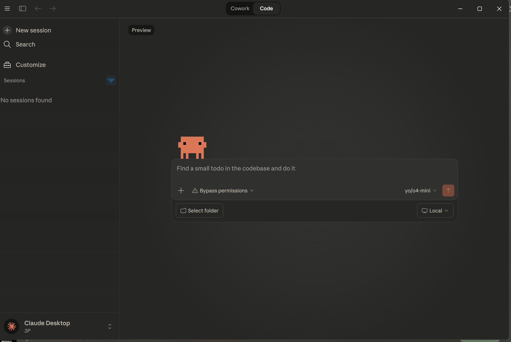
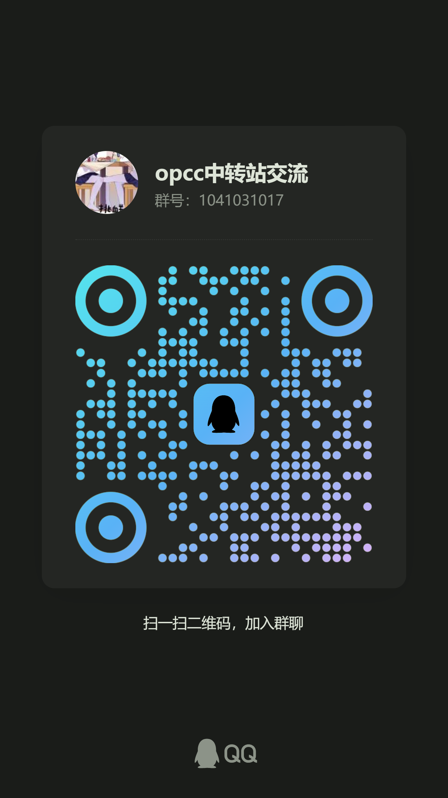

# Claude Desktop Patch

让 Claude Desktop (Windows) 接入自定义 API 端点，免登录使用。

方案 1，2 图示：


方案 3 图示：


---

## 下载

前往 **[Releases](../../releases)** 页面，下载最新版本：

| 文件 | 说明 |
|---|---|
| `Claude-Desktop-vX.X.X-x64.exe` | Claude Desktop 官方安装包 |
| `3p-https-without-login-without-patch.zip` | ⭐ **方案 1**：免登录，HTTPS 端点，不改文件（推荐） |
| `3p-http-without-login-need-patch.zip` | 方案 2：免登录，支持 HTTP 端点 |
| `official-need-login-need-patch.zip` | 方案 3：需登录，解锁隐藏功能 |

> 每日自动检测 Claude Desktop 新版本并发布 Release。

---

## 快速开始

### 准备工作

1. 安装 **[Node.js](https://nodejs.org)**（>= 18）
2. 安装 **Claude Desktop**（从 [Release](../../releases) 或 [官网](https://claude.ai/download) 下载）
3. 确保 `~/.claude/settings.json` 已配置好你的 API 信息（Claude Code CLI 的配置文件）：
   ```json
   {
     "env": {
       "ANTHROPIC_BASE_URL": "https://your-api.com",
       "ANTHROPIC_AUTH_TOKEN": "sk-xxx"
     }
   }
   ```

### 使用步骤

1. 从 [Release](../../releases) 下载对应方案的 zip，解压
2. **双击 `setup.bat`**
3. 脚本会自动读取你的 CLI 配置，一路回车即可
4. 完成后 Claude Desktop 会自动启动

就这么简单！

---

## 三种方案怎么选

### ⭐ 方案 1 - 3P Gateway（推荐）

> 最简单，不修改任何文件，仅写注册表。免登录。

- **适合**：API 端点是 HTTPS 的用户（大多数中转都是 HTTPS）
- **双击** `3p-https-without-login-without-patch/setup.bat` → 自动读取配置 → 重启 Claude 即可
- **卸载**：双击 `3p-https-without-login-without-patch/uninstall.bat`

### 方案 2 - HTTP Patch

> 在方案 1 基础上去除 HTTPS 限制。免登录。

- **适合**：API 端点是 HTTP 的用户（如 `http://localhost:8317`）
- **双击** `3p-http-without-login-need-patch/setup.bat` → 自动构建便携版 + 配置 → 启动
- **卸载**：双击 `3p-http-without-login-need-patch/uninstall.bat`

### 方案 3 - 官方版补丁（需登录）

> 需要 Anthropic 账号登录，解锁 Code Tab、Operon、Computer Use 等隐藏功能。

- **适合**：有官方账号，想解锁额外功能的用户
- **双击** `official-need-login-need-patch/setup.bat` → 自动构建便携版 + 打补丁 → 启动
- **卸载**：双击 `official-need-login-need-patch/uninstall.bat`

### 方案差异一览

| | 方案 1 ⭐ | 方案 2 | 方案 3 |
|---|---|---|---|
| 需要登录 | 否 | 否 | 是 |
| 端点要求 | HTTPS | HTTP / HTTPS | — |
| 修改文件 | 否 | 是（便携副本） | 是（便携副本） |
| 启动方式 | 正常启动官方 Claude | 双击 `launch.bat` | 双击 `launch.bat` |

> **方案 1** 配置后直接从开始菜单打开官方 Claude 就行。
> **方案 2/3** 会生成一个 `claude-portable/` 便携目录和 `launch.bat`，以后从 `launch.bat` 启动。

---

## 进阶用法

方案 1 支持命令行参数，适合自动化场景：

```powershell
# 直接复用 CLI 配置（不交互）
powershell -File 3p-https-without-login-without-patch\setup.ps1 -FromCli

# 手动指定端点
powershell -File 3p-https-without-login-without-patch\setup.ps1 -BaseUrl "https://your-api.com" -ApiKey "sk-xxx"

# 查看当前配置
powershell -File 3p-https-without-login-without-patch\setup.ps1 -Status
```

方案 2/3 也支持命令行：

```powershell
node 3p-http-without-login-need-patch\setup.js --from-cli    # 不交互
node 3p-http-without-login-need-patch\setup.js --status       # 查看状态
node 3p-http-without-login-need-patch\setup.js --uninstall    # 卸载
```

---

## 已知限制

- **Cowork（协作工作区）** 功能暂不可用，仍在研究中。聊天和 Code Tab 正常使用。

---

## 常见问题

**Q: 提示 URL 必须是 HTTPS？**
A: 方案 1 要求 HTTPS 端点（Claude 官方限制）。如果你的端点是 HTTP，请用方案 2。

**Q: Claude 更新了怎么办？**
A: 方案 1 不受影响。方案 2/3 重新双击 `setup.bat` 即可。

**Q: 为什么方案 2/3 要生成便携版？**
A: Claude 安装在系统保护目录（WindowsApps），无法直接修改，所以复制一份到本地再打补丁。

**Q: 方案 3 解锁了哪些功能？**
A: Code Tab（代码编辑器）、Operon、Computer Use、全部 Feature Flags、DevTools（F12）、中文界面、关闭遥测。

---

## 夹带私货

gemini，claude，openAI全模型，包含纯血高速opus4.6（可以用所有检测工具测试）
也有性价比opus4.6(提示词污染)渠道可以免费用哦，
注册、签到、拉新都送token

中转链接：
https://new2.882111.xyz/

交流群


